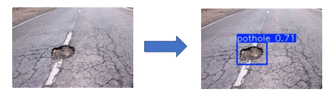

# 🕳️ Pothole Detection using YOLOv5

This project uses **YOLOv5** to detect potholes in road images. It supports training custom models, performing predictions, and visualizing results. The model is trained on a custom dataset and uses PyTorch for inference.


---

## ✅ Features

- 🎯 YOLOv5-based Object Detection Custom-trained YOLOv5 model to accurately detect potholes in road images.
- 🏋️ Custom Model Training Support Easily train your own model on labeled datasets using configurable training scripts.
- 📁 Batch Image Prediction Run inference on a folder of images and automatically save predictions to a target directory.
- 🖼️ Tkinter GUI for Predictions Simple, user-friendly interface with drag-and-drop image upload and grid-style result viewing.
- 🔄 No Redundant Downloads Optimized to avoid re-downloading the YOLOv5 repo or weights on repeated runs.
- 🗂️ Organized Output Structure Predicted images are saved neatly in a single folder without unnecessary subdirectories.
- 🧩 Modular Codebase Clear separation between training, prediction, GUI, and utility functions for easy maintenance.
- 🔭 Scalable for Future Upgrades Designed with future integration in mind: MLflow for tracking and AWS for automated retraining pipelines.

---

## 🏗️ Project Structure

```
├── configs/
│   └── data.yaml             # Training configuration file
│   └── predict.yaml             # Prediction configuration file
├── data/
│   └── raw/                    # Raw
│   │   ├── Images              # raw images
│   └── └── Labels              # Raw labels
├── outputs/
│   └── plots/                  # Prediction plots
├── scripts/
│   └── run_pipeline.py         # Main pipeline script
├── src/
│   ├── data/
│   │   ├── data_loader.py       # Load datasets
│   │   └── data_preprocessor.py # Preprocess datasets
│   ├── models/
│   │   └── lstm_model.py        # Define LSTM model
│   ├── trainer/
│   │   └── train_and_predict.py # Training and prediction logic
│   └── utils/
│       ├── logger.py            # Logger setup
│       └── plotter.py           # Plotting utilities
├── mlruns/                     # MLflow tracking data
├── requirements.txt            # Project dependencies
├── README.md
└── .gitignore
```

---

## 🚀 Quickstart Guide

Follow these steps to set up and run the project locally:

### 1. Clone the Repository

```bash
git clone https://github.com/your-username/pothole-detection-yolov5.git
cd pothole-detection-yolov5
```

### 2. Set Up a Virtual Environment (Recommended)

```bash
python -m venv venv
# Activate the environment
source venv/bin/activate    # For Linux/Mac
venv\Scripts\activate       # For Windows
```

### 3. Install Project Dependencies

```bash
pip install -r requirements.txt
```

### 4. Prepare Your Data

- Place your data images **Images** and **Labels** inside the `data/raw/` folder.
- Ensure your labels should be in yolo format i.e., <class> <x_center> <y_center> <height> <width>.

Example structure:

```
[0 0.2 0.3 0.1 0.4]
...
```

- Edit the configuration file `configs/data.yaml` to match your data paths and training settings:

```yaml
python yolov5/train.py \
--img 640 \
--batch 16 \
--epochs 100 \
--data configs/data.yaml \
--weights yolov5s.pt \
--name pothole_yolov5s \
--device 0 \
--project outputs/runs \
--exist-ok
```

### 5. Run the Full Training Pipeline

```bash
python pipelines/run_pipeline.py --for training
python pipeline/predict_potholes.py --for prediction
```

✅ This will:

- Train the yolo model
- saves weights in `outputs/runs/`

---

## 📦 Requirements

All dependencies are listed in `requirements.txt`:

```plaintext
tensorflow==2.15.0
mlflow==2.10.2
pandas==2.2.1
numpy==1.26.4
matplotlib==3.8.4
scikit-learn==1.4.2
pyyaml==6.0.1
h5py==3.10.0
```

Install them using:

```bash
pip install -r requirements.txt
```

---

## 📊 Prediction

Each time you run training:

- The trained model weights is logged inside the `outputs/runs/model_name/best.pt` directory.
- change this directory in predict.yaml to change model.
- place all images needed to predict in `predictions/Input`
- predicted output can be seen in `predictions/Output`

---

## 🙌 Contributing

Contributions, issues, and feature requests are welcome!\
Feel free to ⭐ the repo if you find it useful!

---

## 📬 Contact

Created by Venkata Sai Rohith Andanala – feel free to reach out via GitHub Issues or pull requests.

---
